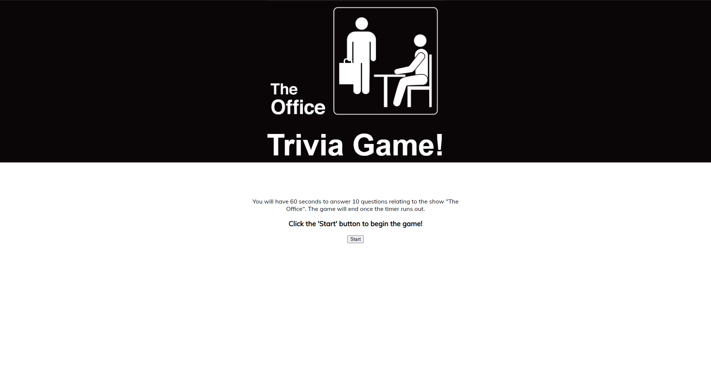
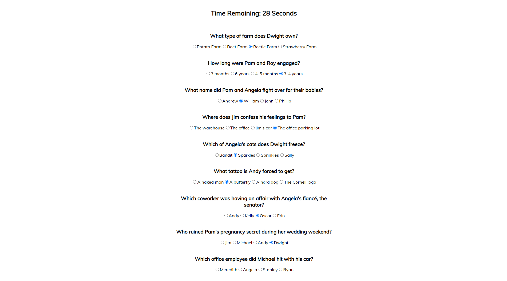
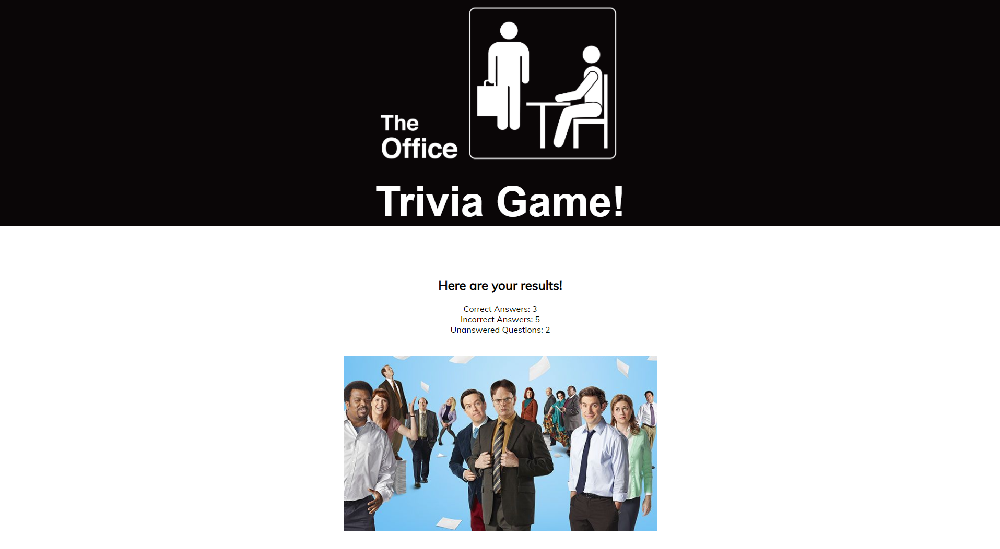

# The Office Trivia

## Overview
This web application is a trivia game based on the hit mockumentary show - The Office. This quiz has 10 questions about the show and you have to answer them in under 60 seconds. If you run out of time, the game will end and the unanswered questions wil be accounted for in the end results.
*Audio warning: The show's opening theme song will play when you start the game.
  
### To start...
Read the directions of the game and prepare yourself for the quiz. When you are ready, hit the start button and proceed to answering a series of questions.

### During the quiz...
Answer as many questions as you can with the given duration of time. 

### Your results!
When you click submit or run out of time, the game will end and your results will appear on the screen.

### Built with:
* HTML/CSS
* JavaScript
* jQuery

Test your knowledge of The Office [here](https://melaniejindali.github.io/TriviaGame/)!
